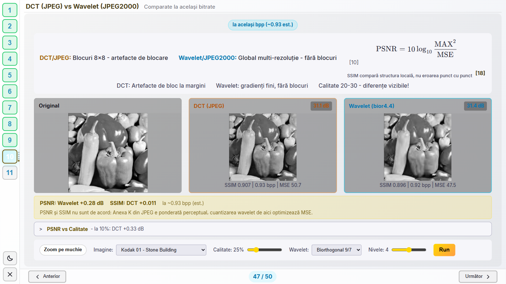
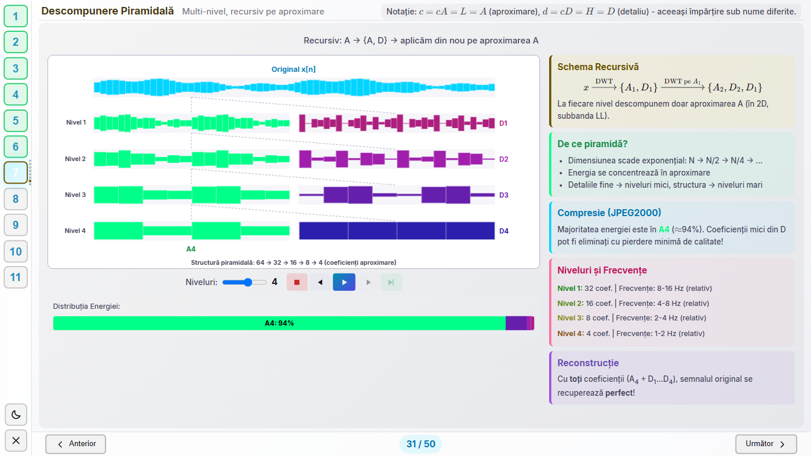

# Wavelets in Image Processing

An interactive presentation about the wavelet transform, built as a web application
rather than a slide deck. Fifty screens run from the Fourier transform through filters,
convolution and the Mallat algorithm to denoising and a JPEG versus JPEG2000 comparison.
The demos on them are not prerecorded animations: filters are applied in the frequency
domain, the decomposition runs through PyWavelets, and the comparison at the end really
does compress the image with both codecs and report the numbers it measured.

The presentation itself is in Romanian; this file and the code are in English.

**Live: <https://ale0204.student-dev.ro/dsp/>**



## The course

By **Neamțu Alexandra**, written for **Prelucrarea Semnalelor** (Signal Processing),
CTI year 3, semester 1, at the Faculty of Mathematics and Computer Science, University
of Bucharest. The course is held by **prof. univ. dr. habil. Paul Irofti**, and his materials are at
<https://cs.unibuc.ro/~pirofti/ps.html>.

The theory here is his. Lecture 10 is the wavelet transform and lecture 7 the DCT and
JPEG, and those two carry most of this deck. The labs are where the NumPy in the backend
comes from, and the JPEG encoder assignment is the reason the comparison at the end
exists at all. What this repository adds is the interactive half: a parameter can be
moved during the talk and the room sees what changes.

## What the demos compute

The heavy demos call a Python backend and draw what comes back:

| Screen | Endpoint | What runs |
|---|---|---|
| Fourier | `/api/fourier/function`, `/api/fourier/image` | DFT of a built-up signal and of an image, spectrum and reconstruction |
| Filters | `/api/filters/*` | low, high and band-pass applied in the frequency domain; the chosen shape and order reach the computation, not just the drawn curve |
| Kernels | `/api/kernels/*` | 2D convolution over an image and over pixel-art sprites, with each kernel family rebuilt rather than interpolated when the radius grows |
| Denoising | `/api/denoise-sample/*` | wavelet thresholding on a noisy image, scored with SNR |
| Comparison | `/api/compare-sample/*` | JPEG and wavelet compression of the same image, matched to the same bitrate, scored with PSNR, SSIM and bpp |
| ECG | `/api/ecg-demo` | synthetic PQRST trace under muscle noise, wavelet-denoised, with R-peak detection and the resulting BPM |

The rest are drawn in the browser, with Haar filters written directly in JavaScript:
the step-by-step decomposition, the filter bank, the pyramid, the reconstruction, the
scalogram, the Heisenberg boxes and the intermediate stages of the JPEG pipeline. They
illustrate a mechanism on a signal chosen for the purpose, so no figure in the written
document rests on a number they produce.

The comparison took the most care to get right. Two codecs set to the same quality
number are not comparable, because the two quality scales mean different things, so the
backend first searches for the setting that lands both at the same bits per pixel and
only then compares the images.



## Stack

- **Frontend** - React 18 and Vite. Every plot is a hand-drawn 2D canvas with HiDPI
  support (`src/components/shared/useHiDPICanvas.js`, `shared/Graph.jsx`). KaTeX is
  bundled through npm, so the mathematics renders with no network at all, which matters
  in a room where the network is not guaranteed.
- **Backend** - FastAPI with NumPy, SciPy, Pillow and PyWavelets. 29 endpoints under
  `/api`, all of them in `backend/main.py`, plus the test images.
- **Design surface** - everything is authored on a fixed 1440x810 surface and scaled
  proportionally to the real window (`shared/stage.js`), so a deck built for a projector
  loses nothing on a smaller monitor.

## Running it

Two terminals.

```bash
# 1. backend, port 8000
cd backend
pip install -r requirements.txt
python -m uvicorn main:app --reload --port 8000

# 2. frontend, port 3000
cd frontend
npm install
npm run dev
```

Open <http://localhost:3000> and press "Pornește prezentarea". Vite proxies everything
under `/api` to the backend, so the frontend holds no hardcoded URL. Any screen opens
directly by its hash, for example <http://localhost:3000/#compare-demo>; the ids are the
ones in the `SLIDES` array. Without the backend the presentation still opens, and the
demos that need computation stay empty.

Node 20 or newer, Python 3.12.

## The checks

Fifty screens are too many to proofread by eye after every change, so four checks do it
mechanically. They live in `scripts/` and share one dependency, `playwright-core`, which
drives an already-installed Chrome or Edge rather than downloading a browser.

```bash
cd scripts
npm install          # once

npm run lint         # forbidden glyphs in the source
npm run register     # punctuation habits in the written prose
npm run gate         # walks all 50 screens, 8 classes of defect
npm run interaction  # presses every control on every screen
npm run check        # all four
```

- **lint** forbids any Unicode character standing in for content: mathematics is always
  LaTeX, never a precomposed Greek letter or superscript, and every icon is inline SVG,
  never an emoji or a geometric character that renders differently on another machine.
- **register** counts the punctuation habits that make prose read as machine-written,
  measured against human-written Romanian technical prose from the same course: spaced
  dashes, semicolons standing in for a full stop, and the "not X, but Y" construction.
- **gate** walks the whole tour in a real browser and reports, per screen, content that
  scrolls or falls outside the frame, clipped elements, overlapping elements, controls
  covered by something else, mathematics below the legibility floor, unrendered `$...$`
  or `[cite:...]` markup, duplicated titles, and JavaScript console errors. `--shots`
  also writes one screenshot per screen.
- **interaction** presses every button, sweeps every slider, switches every select and
  ticks every checkbox on every screen, with a screenshot before and after each action,
  then measures whether anything moved unexpectedly or escaped its box. The last pass
  drove 186 controls across the 50 screens: every image and canvas stayed inside its
  parent box, and no screen raised a console error.

None of the three can see what is drawn inside a canvas, and most of the plots live
inside a canvas, so the screenshots they leave behind still have to be read by a human.

## Project layout

```
frontend/src/components/
    GuidedTour.jsx        the SLIDES array: order, titles and text of all 50 screens
    <Name>View.jsx        one demo per file (FourierView, CompareView, ...)
    shared/               design surface, SVG icons, citation registry, rich text,
                          each reusable piece next to its own stylesheet
frontend/src/styles/      theme tokens, tour layout, the math legibility floor
    views/                one stylesheet per screen, the only home for them
backend/main.py           every /api endpoint
data/                     Kodak and USC-SIPI test images, plus 16x16 and 32x32 sprites
docs/suport/              written support document (LaTeX source and the built PDF)
docs/scenariu/            the spoken script, one file per section
scripts/                  the four mechanical checks
_build/                   anywhere it appears: generated output, never committed
```

`SLIDES` in `GuidedTour.jsx` is the single source of truth for the content. A screen is
an object with an `id`, a `type`, a `title` and whatever its type needs; 23 of the 50 are
`embed`, meaning they mount a full demo component. Inline mathematics is written `$...$`
and citations `[cite:key]`, where the key comes from `shared/sources.js` - a registry of
19 sources whose order is the `[n]` numbering, so the bibliography screen renumbers
itself when a source is inserted.

## Docker

The whole thing runs from one image: Vite compiles the frontend, then FastAPI serves both
the API and the compiled files on the same port.

```bash
docker compose up --build     # http://localhost:8000
```

Nothing host-specific is committed here: accounts, networks, server directories and TLS
depend on where it is hosted, so they live outside this repository.

## Documentation

- `docs/suport/suport.pdf` - the written support document, ten chapters with figures and
  a table of contents, built from the LaTeX sources next to it.
- `docs/scenariu/` - what to say out loud, one file per section, with the demo actions
  marked inline.

## Credits

Test images come from the [Kodak Lossless True Color Image
Suite](http://r0k.us/graphics/kodak/) and the [USC-SIPI
database](https://sipi.usc.edu/database/); the details are in
`data/standard_test_images/README.md`. The bibliography screen lists the 19 primary
sources the presentation leans on, every link checked live before it shipped.

This is coursework. Reuse whatever is useful; a link back is enough.
